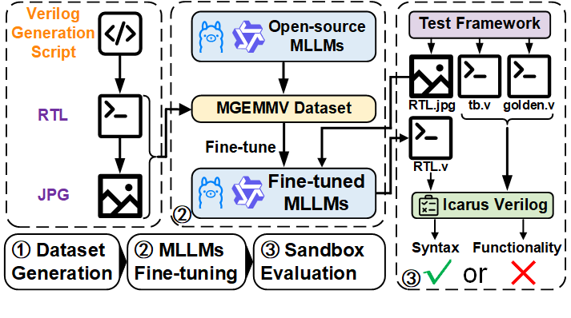

<p align="center">
  
</p>

<h2 align="center">MGEMMV: A Multimodal LLM-Based Framework for GEMM Verilog Generation </h2>

**MGEMMV** is an open-source multimodal framework designed for Verilog generation of GEMM modules.  
It provides:  

- **Hierarchical Multimodal Dataset**: automatically generated circuit-diagram–Verilog pairs, covering both basic logic and GEMM-level modules with diverse hardware optimization techniques (HOTs).  
- **Automated Evaluation Framework**: scalable pipeline for syntax and functionality correctness verification of LLM-generated designs.  

Experiments show syntax correctness up to **94.6%** and functionality correctness up to **90.0%**, significantly surpassing existing baselines.

## Environment Setup

MGEMMV requires both Python dependencies and external EDA/simulation tools.  
We recommend using [OSS CAD Suite](https://github.com/YosysHQ/oss-cad-suite-build) as the primary distribution.

### 1. Dataset Generation
- Python libraries (see `requirements.txt`)
- EDA tools: [Yosys](https://yosyshq.net/yosys/) (included in OSS CAD Suite)
- [PyVerilog](https://github.com/PyHDI/Pyverilog) for Verilog parsing
- [Graphviz](https://graphviz.org/) for visualization

### 2. Automated Testing
- Python libraries (see `requirements.txt`)
- [Icarus Verilog (iverilog)](http://iverilog.icarus.com/) for functional verification
- LLM backends:
  - commercial multimodal models (requires `API_KEY`)
  - or a local inference server

### 3. Installation
- Install Python requirements:
  ```bash
  pip install -r requirements.txt

## Dataset Generation

MGEMMV provides a script-driven pipeline to automatically construct the hierarchical multimodal dataset. The process includes Verilog source generation, synthesis, netlist processing, circuit diagram conversion, image post-processing, and consistency checking.

### Step 1: Navigate to the scripts directory
```bash
cd scripts
````

### Step 2: Generate Verilog source code

Create the raw Verilog modules required for dataset construction.

```bash
python yosys_code_gen_example.py
```

### Step 3: Perform logic synthesis with Yosys

Convert Verilog source code into JSON netlist files.

```bash
python yosys_run_example.py
```

### Step 4: Process synthesized JSON files

Normalize and clean netlist representations.

```bash
python replace.py
```

### Step 5: Convert JSON netlists into circuit diagrams

* JSON → JPG:

  ```bash
  python json4jpg.py
  ```
* SVG → JPG:

  ```bash
  python svg4jpg.py
  ```

### Step 6: Post-process large images

Resize or filter oversized diagrams to meet dataset constraints.

```bash
python process_image.py
```

### Step 7: Verify dataset consistency

Ensure that each JSON entry has a corresponding image file.

```bash
python compare_json_folder.py
```

---

After completing these steps, the dataset will contain:

* **Verilog source files** (logic and GEMM modules)
* **JSON netlists** (structural representation)
* **Aligned circuit diagrams** (JPG/SVG format)

This dataset serves as the foundation for circuit-diagram-to-Verilog (CD2V) tasks and downstream evaluation.


## Model Evaluation

MGEMMV provides an automated evaluation framework to benchmark Verilog generation across different LLMs. The evaluation pipeline supports multiple backends and reports **Pass@k** metrics.

### Step 1: Navigate to the evaluation scripts

```bash
cd evaluation/TestSet/python
```

### Step 2: Select an evaluation script

Choose the script based on the LLM interface you want to test:

* `adapter_llm_test.py` – adapter-based evaluation
* `api_llm_test.py` – API-based evaluation
* `full_llm_test.py` – full-model evaluation

### Step 3: Run the evaluation

Execute the desired script with appropriate configuration, then compute **Pass\@k** results:

```bash
python Pass@k.py
```

---

The framework will output syntax correctness, functionality correctness, and Pass\@k results, enabling comparison across different LLMs.


